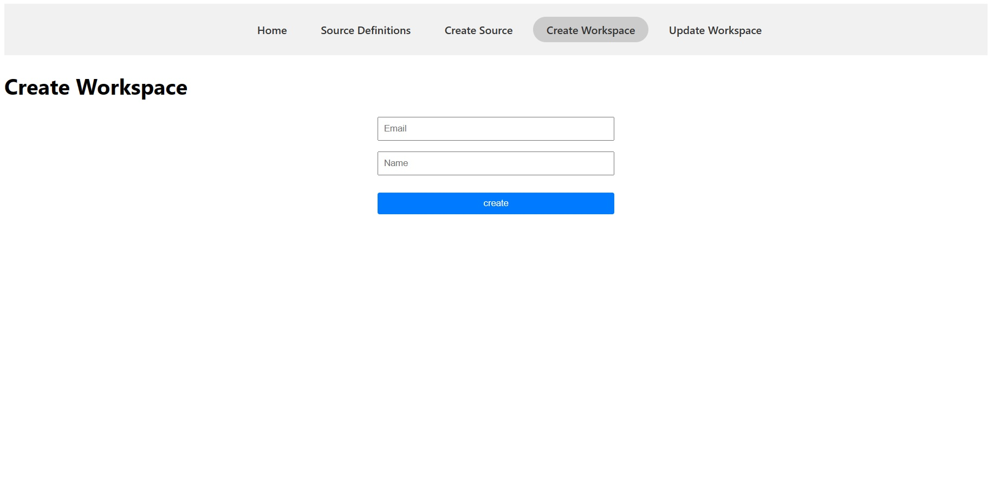

## Run Locally

### Note

- start remote server before running project locally

Clone project https://github.com/hisham8989/source-management.git

Go to the project directory

```bash
  cd airbyte_source_management
```

Install dependencies

```bash
  npm install
```

run app in development

```bash
  npm run dev
```

Go to browser and redirect to http://localhost:5173/

## Screenshots

### List of sources that workspace have


### Create workspace



### Update workspace


### Create Source


### List of source definitions


